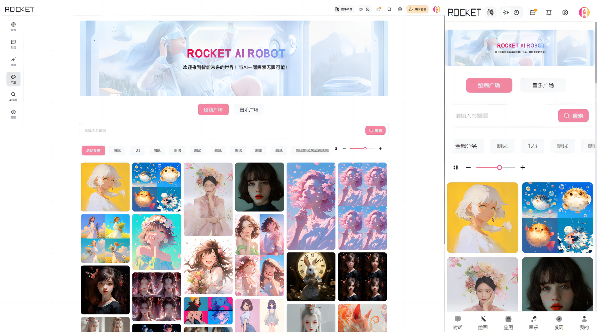
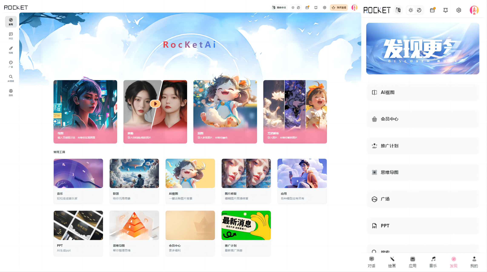

# RocketAI 基础版

RocketAI：基于 NineAI 2.4.2 二开的可商业化 AI Web 应用（免授权，无后门，非盗版，已整合前后端整合包）。

未编译源码暂不开源，相比基础版，PRO版进度更快一些。

## 页面预览

**对话聊天**

**绘画**

**图片详情**

**音乐**（Pro支持）

**绘画广场**

**发现**

**模型选择**

**搜索**

**应用**

## 更新日志

### 基础版 v1.0.0

- 自适应布局、适配PC、移动端、平板等设备
- 支持多种模型的聊天、内置中转系统可对接几十+模型
- 支持联网模式、可对模型进行扩展搜索当前网络实时内容总结
- 支持气泡列表多种类型布局
- 对话模型自定义分类、自定义名称自定义排序、以及部分功能自定义
- 自定义模型扣除费用类型、扣除金额数量等
- 账号卡池不限量、支持设置权重控制key的调用量、保障并发
- 对话会话隔离、云端存储、支持多设备共享数据！
- 内容敏感词多种限制、支持自定义敏感词/百度内容审核等安全检测、可共同开启
- 对话多模态支持： 支持自定义对话模型开启多模态支持
- Midjouney联想功能
- 应用中心：支持GPTS
- AI绘画支持：Midjouney全功能覆盖支持
- 思维导图：一键根据需求生成思维导图，可导出不同类型图片
- 绘画广场： 展示ai绘画的内容、展示推荐内容、管理端可手动推荐图片，画廊分类
- 应用中心：支持管理端后台主动添加应用、可自定义配置应用
- 登录系统： 支持 邮箱 | 手机短信 | 微信扫码 等不同登录注册方式供选择
- 会员系统： 提供高级初级两种货币类型、支持各类商品自定义扣费模式与额度
- 商城系统： 自定义商品套餐、可自定义生成永久套餐、限时套餐
- 分销系统： 支持 A + B 分销模式、后台可自定义分销提成额度、可对单独用户单独设置
- 卡密系统： 支持批量生产卡密供用户兑换、用户端可兑换卡密或三方卡网购买
- 签到系统： 支持配置每日签到赠送不同额度的奖励
- 访客系统： 支持不登录使用部分内容、可游客模式体验站内功能
- 存储系统：支持阿里云OSS、腾讯云cos、Chevereto图床多种类型
- 动态菜单系统：可以自定义开关菜单、添加菜单、自定义ICON、自定义菜单类型、可使用三方站点内嵌。
- 管理端支持自定义配置网站LOGO、名称、百度统计、AI名称、提示欢迎语等多种内容
- 管理端 支持默认AI头像用户头像设置
- 管理端支持超管和普通演示账户用于分销系统、普通账号仅可读权限
- 管理端支持锁定封禁单独账户
- 管理端支持配置关键词回复、可自定义关键词及回复内容-系统应用】
- 新增模型配置选项，允许设置模型调用频率限制，确保用户体验

### PRO版已/将支持

- AI音乐：支持中转suno-v3，suno-v3.5，支持续唱（单独界面支持）
- AI一键生成PPT
- AI抠图
- AI图片变清晰
- AI黑白照片上色
- MJ换脸、咒语解析、混图
- 更多功能持续开发中 ··· ···

<!-- 

 -->

## 宝塔安装部署

部署教程链接：https://sw8q409p69d.feishu.cn/wiki/IlLJwApHqiAjIYkUmsvcWLlmn6f

## 管理平台

- **管理端地址**：`/admin`

- **超级管理员账号**：`rocket`

- **密码**：`123456`

请使用超级管理员账号登入后台，并及时修改密码。

## 学习交流

扫码添加，拉交流群。（不接受私聊技术咨询，有问题优先群内交流）

